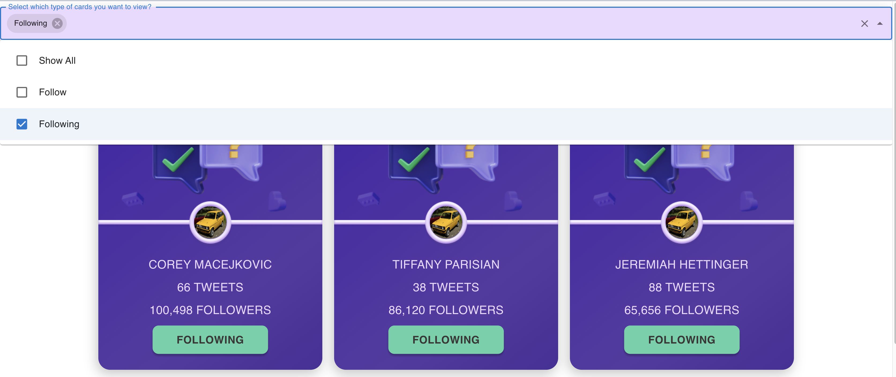
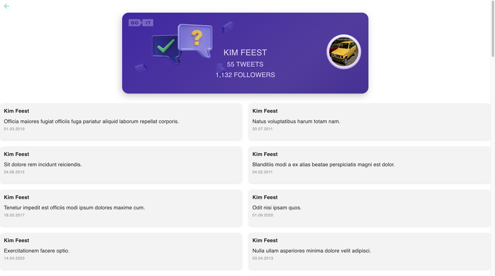

💬 TWEETS 💬

🍀 You can visit the live page by following the link [click here...](https://s-chili.github.io/tech_task/)

## Contents

🍀 [Introduction](#introduction)
🍀 [Properties](#properties)
🍀 [Requirements for the environment](#requirements-for-the-environment)
🍀 [Installation](#installation)
🍀 [Usage](#usage)
🍀 [Authors](#authors)


## Introduction

This is a project that contains user cards with personal information (name, avatar, number of tweets, number of followers). 

## Properties

You can also see what tweets a user has - by clicking on tweets, and you can follow any user. It is possible to filter users to whom you are subscribed or, conversely, to whom you have not yet subscribed.

The backend for development was created using the mockapi.io UI service

## Requirements for the environment

🍀 @mui/icons-material
🍀 @mui/material"
🍀 faker-js/faker
🍀 react
🍀 react-redux
🍀 axios

## Installation

```bash
$ git clone https://github.com/s-chili/tech_task.git
$ Open a terminal and navigate to the root of your project.
$ Run the `npm install` command to install the project dependencies.
$ Scripts: - `npm start` 
```

## Usage








## Authors

The project was implemented by:


  <a href="https://github.com/s-chili">
  	
  </a>

 - [ **Anastasiia Tatarova**: Full-stack developer](https://github.com/s-chili)